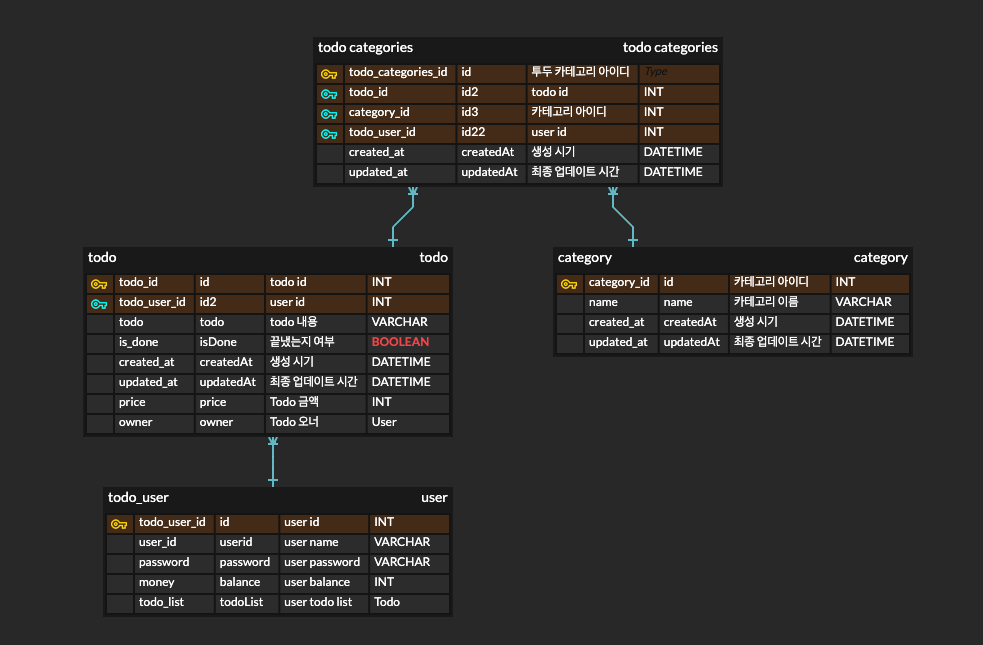

# Todo application

### 📌 Advanced To-Do List 요구사항 정리

1️⃣ 기본 기능
사용자는 할 일을 추가, 수정, 삭제할 수 있다.\
완료된 할 일은 체크할 수 있으며, 완료/미완료 상태를 관리할 수 있다.

2️⃣ 카테고리 기능
할 일은 카테고리에 속할 수도 있고, 속하지 않을 수도 있다.\
하나의 할 일은 여러 개의 카테고리에 포함될 수 있다.\
사용자는 카테고리만 따로 추가할 수도 있다.

3️⃣ 로그인 및 공유 기능
로그인한 사용자는 본인의 To-Do List를 관리할 수 있다.\
다른 사용자의 To-Do List를 조회할 수 없다.

4️⃣ 성능 최적화 (캐싱)
사용자의 To-Do List를 빠르게 불러오기 위해 캐싱을 적용한다.\
자주 조회되는 데이터는 Redis를 활용하여 성능을 최적화한다.

5️⃣ 배포 및 운영 환경
To-Do List 서비스는 DockerFile을 이용 DockerHub로 이미지 배포중이다.\
또한 Docker Compose, Docker Swarm을 이용하여\
자동 확장(Auto Scaling) 및 로드 밸런싱을 지원\
다중 인스턴스를 활용한 고가용성(HA) 아키텍처 구축 가능

6️⃣ 투두 판매 및 충전 기능
사용자는 자신이 작성한 할 일을 포인트로 판매할 수 있다.
다른 사용자는 해당 할 일을 포인트를 지불하고 구매할 수 있다.
포인트는 충전 기능을 통해 획득할 수 있으며, 사용자마다 포인트가 관리된다.

7️⃣ 동시성 처리
투두 판매 시 여러 사용자가 동시에 구매 요청을 보낼 수 있다.
중복 구매를 방지하고 일관성을 보장하기 위해 Redis 분산 락을 적용한다.
이를 통해 데이터 무결성과 안정성을 확보한다.

8️⃣ 테스트 코드
모든 주요 비즈니스 로직에 대해 단위 테스트 및 통합 테스트를 작성한다.
Mockk, kotest, 테스트용 Redis 및 DB 환경을 구성하여 안정적인 테스트 환경을 보장한다.
Spring Boot Test와 JUnit5 기반으로 테스트 코드를 작성한다.

---

## 🧪 실행 명령어 안내

### 실행시에는, .env 파일이 필요합니다.

### 🔹 로컬 개발용

| 명령어                  | 설명                                                  |
| -------------------- | --------------------------------------------------- |
| `make local-up`      | 로컬 개발 환경 컨테이너 실행 (`docker-compose.override.yml` 포함) |
| `make local-down`    | 로컬 개발 환경 컨테이너 중지 및 삭제                               |
| `make restart-local` | 로컬 컨테이너 재시작 (= down 후 up)                           |

### 🔹 프로덕션 배포용 (테스트 겸용)

| 명령어                 | 설명                         |
| ------------------- | -------------------------- |
| `make prod-up`      | 서버 이미지 pull 후 프로덕션 컨테이너 실행 |
| `make prod-down`    | 프로덕션 컨테이너 종료 및 삭제          |
| `make restart-prod` | 프로덕션 컨테이너 재시작              |

### 🔹 Docker Swarm 기반 스택 운영

| 명령어               | 설명                                            |
| ----------------- | --------------------------------------------- |
| `make stack-up`   | Docker Swarm 초기화 후 스택 배포 (`todo-stack` 이름 사용) |
| `make stack-down` | Docker Swarm 모드 종료                            |
| `make stack-ps`   | 현재 배포된 스택 내 서비스 상태 확인                         |
